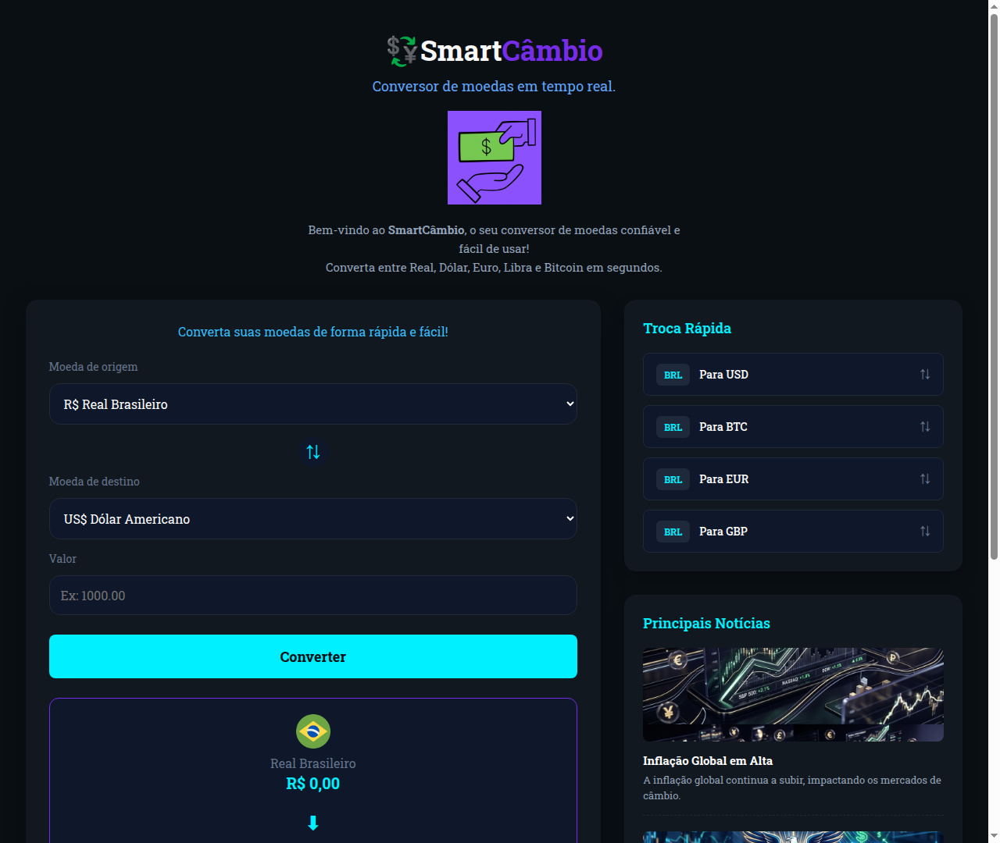

# 💱 SmartCâmbio - Conversor de Moedas em Tempo Real

O **SmartCâmbio** é um conversor de moedas moderno, interativo e responsivo. Ele permite a conversão em tempo real entre diversas moedas populares, consumindo cotações atualizadas diretamente de uma API financeira.

Este projeto foi desenvolvido como parte do currículo de estudos de desenvolvimento web do **DevClub**.

---

## 📸 Demonstração do Projeto



---

## 🚀 Funcionalidades

- **Cotações em Tempo Real:** Integração com a API pública *AwesomeAPI* para buscar as cotações do segundo exato em que a página é carregada.
- **Conversão Bidirecional Completa (Any-to-Any):** Permite converter de qualquer moeda de origem para qualquer moeda de destino. Moedas suportadas:
  - 🇧🇷 Real Brasileiro (BRL)
  - 🇺🇸 Dólar Americano (USD)
  - 🇪🇺 Euro (EUR)
  - 🇬🇧 Libra Esterlina (GBP)
  - ₿ Bitcoin (BTC)
- **Tabela de Cotações Dinâmica:** Exibe os preços atuais e as variações percentuais das últimas 24 horas, destacando altas (em verde) e baixas (em vermelho).
- **Botão de Inversão Rápida (⇅):** Um clique inverte a moeda de origem com a de destino, alterando as bandeiras, nomes correspondentes e recalculando os valores instantaneamente.
- **Atalhos Rápidos:** Painel lateral de "Troca Rápida" para configurar as conversões mais comuns com um único clique.
- **Formatação Inteligente:** Exibição monetária formatada conforme os padrões e localidade de cada moeda, incluindo formatação especial de até 8 casas decimais para Bitcoins.
- **Responsividade:** Layout adaptável e otimizado para celulares, tablets e desktops.

---

## 🛠️ Tecnologias Utilizadas

- **HTML5:** Estrutura semântica e acessível.
- **CSS3:** Estilização moderna com design de colunas (CSS Grid e Flexbox), variáveis CSS, tema escuro, efeitos de hover e micro-animações.
- **JavaScript (ES6):** Manipulação de DOM, requisições assíncronas com `fetch` e `async/await`, lógica matemática de conversão cruzada e formatação monetária internacional com a API `Intl.NumberFormat`.
- **API de Cotações:** AwesomeAPI (cotações de moedas e cripto em tempo real).

---

## 💻 Como Executar o Projeto

1. Clone o repositório em sua máquina:
   ```bash
   git clone https://github.com/brunovbarcelosdev-design/Conversor-de-Moedas.git
   ```
2. Navegue até a pasta do projeto e abra o arquivo `index.html` em seu navegador.
3. Se estiver usando o VS Code, você pode utilizar a extensão **Live Server** para rodar o projeto localmente com recarregamento automático.

---

## 👤 Autor

Desenvolvido por **Bruno Venancio Barcelos**.
<br />
*Estudante de Desenvolvimento Web & Design.*
